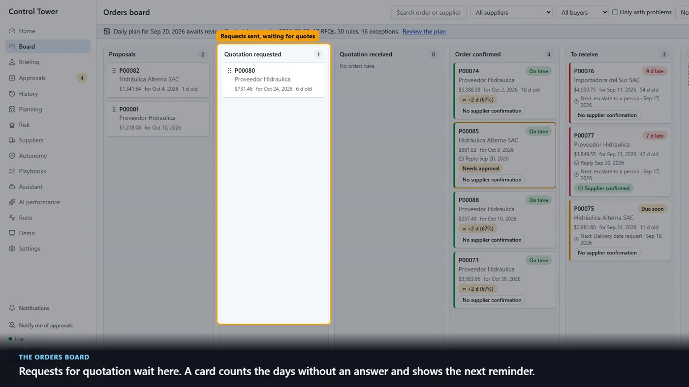
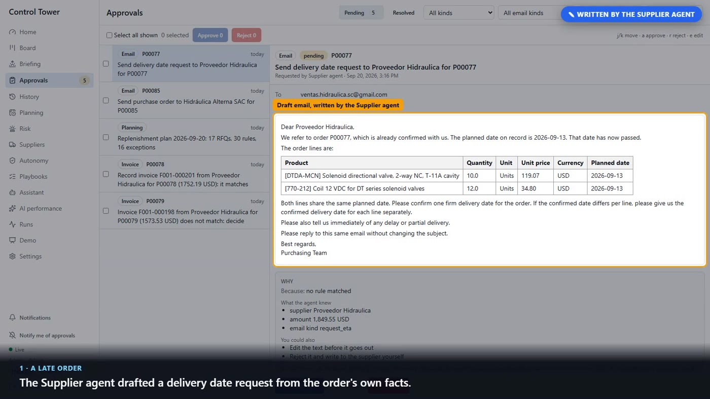
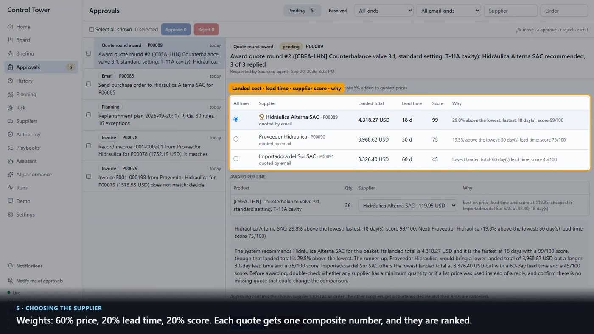
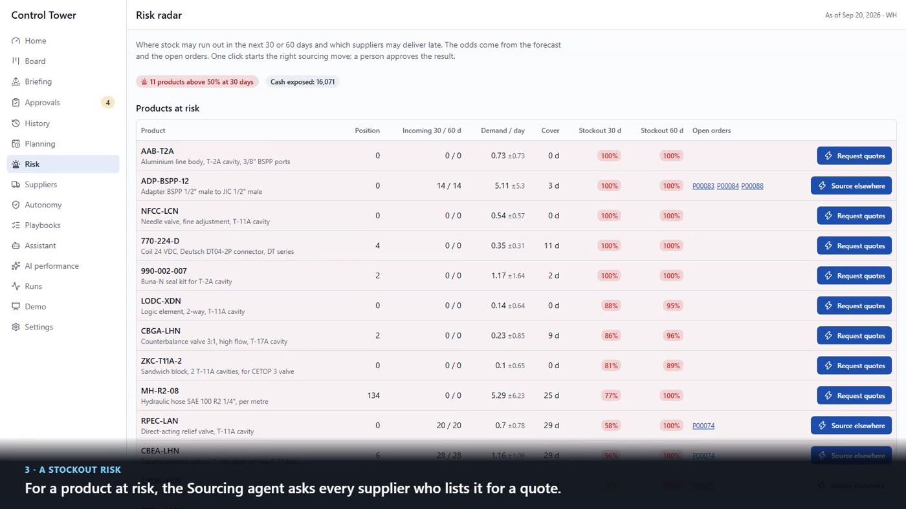
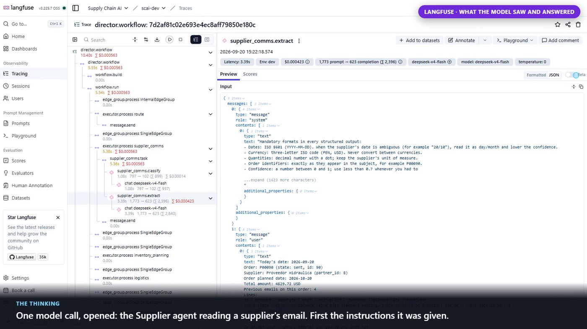
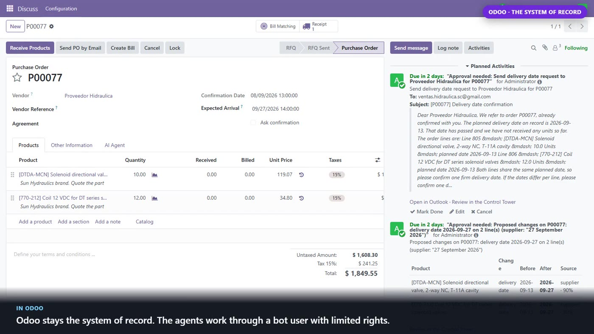
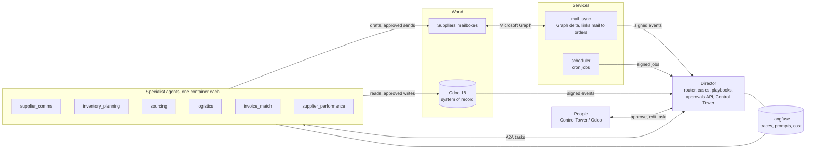

# Supply Chain AI Agents

**Your inbound supply chain, run by AI agents. People decide; every step is auditable.**

A team of AI agents that runs a company's purchasing on top of Odoo 18, with a real
mailbox and real emails: they chase late orders, read suppliers' replies, plan what to
buy, run quote rounds and negotiate, reconcile receipts, match invoices and score
suppliers. A **Director agent** coordinates six specialists, and a web app (the Control
Tower) is where people see everything and approve what matters.

**▶ Watch one full day, narrated:** [English (6:44)](video-demo/demo-en.mp4) · [Español (8:00)](video-demo/demo-es.mp4)

[](video-demo/demo-en.mp4)

## What makes it different

- **The model never writes to the ERP.** Models read, draft and explain. Every write to
  Odoo and every email is made by deterministic code, behind a person's approval or an
  autonomy rule that a person set.
- **Every proposal explains itself**: the facts the agent used, the rule that applied, its
  confidence, what else you can do, and what would have let it run without you.
- **Autonomy is a policy, not a mood.** Rules say what may run alone (by kind, supplier,
  amount, confidence). Widening a rule needs a second person and shows a 30-day preview
  first. Awards and counter-offers can never be automated.
- **Everything is traceable.** Each agent run is a trace in Langfuse with the full prompt,
  the answer, the time and the cost. A full demo day costs a few cents of model usage.
- **No email content is stored.** Only links, ids and addresses are kept; the text of an
  email lives in the mailbox and in a run's memory while it works.

## The agents

| Agent | What it does |
| --- | --- |
| **Director agent** | Routes every event (an email, a confirmed order, a receipt, a bill) to the right agent by a table, never by a model. Keeps one case per order, runs multi-day playbooks (remind, ask for a date, escalate, find another source), answers questions in a chat with citations, and writes the morning briefing. |
| **Supplier agent** | Writes to suppliers (RFQs, purchase orders with Odoo's PDF, delivery date requests, reminders) and reads their replies: prices, lead times, dates, questions, shipping notices, invoices. |
| **Planning agent** | The daily replenishment plan from two years of demand: forecast chosen by backtest, safety stock and reorder points from formulas you can recompute by hand, and a stockout risk radar at 30 and 60 days. |
| **Sourcing agent** | Asks every supplier who lists a product for a quote, compares landed cost, lead time and the supplier's measured score, recommends an award per line, and proposes counter-offers within limits the buyer sets. |
| **Logistics agent** | Reads shipping notices into delivery dates, reconciles each receipt against the order, and drafts the discrepancy report when a delivery arrives short. |
| **Invoice agent** | Three-way match of invoice, order and receipt, line by line. Holds price and quantity differences for a person; never posts an accounting entry. |
| **Performance agent** | Weekly supplier scorecards from what suppliers actually did: on time and in full, observed lead time, promise drift, reply time, receipt problems. The scores feed planning and sourcing. |

How each one works, with its settings: [docs/agents.md](docs/agents.md).

## A day in the demo

`docs/demo.md` scripts one day against a demo supplier with a real Gmail mailbox. The
supplier's replies are real emails; the warehouse and accounting act in Odoo.

1. An order is late: the Supplier agent asks for a firm delivery date.
2. The supplier answers: the new date is proposed line by line, and Odoo changes only after a person approves.
3. A product is about to run out: a quote round goes to three suppliers.
4. One quote is above target: the Sourcing agent proposes a counter-offer with its evidence.
5. The supplier accepts, the quotes are compared, a person awards, and Odoo confirms the order.
6. A delivery arrives short: the discrepancy report is drafted from the count.
7. A bill comes 3% above the order: the Invoice agent holds it for a decision.
8. Next morning, the briefing: what happened, what ran alone, what needs you.

| | |
| --- | --- |
|  |  |
| A draft written by the Supplier agent, with the "why" panel | How a supplier is chosen: three quotes on the same terms |
|  |  |
| Stockout odds per product, with the cash at stake | One model call, opened: what the model saw and answered |
|  | |
| Odoo stays the system of record; agents work through a bot user with limited rights | |

`just demo-auto` runs the whole day unattended in about four minutes; `just demo-video`
films it as a narrated, captioned video (English or Spanish); the two published takes are in
[`video-demo/`](video-demo/).

## Architecture



- **Events in, tasks out.** Odoo, the mailbox sync and the scheduler post signed events
  (HMAC) to the Director. A routing table turns each event into tasks for agents, sent over
  the **A2A protocol**. The Director's workflow is built with **Microsoft Agent Framework**.
- **Inside an agent**, a **LangGraph** graph does the work: load facts from Odoo, call the
  model where reading or writing text is needed, compute everything else in code, then pause
  on an approval. The state is checkpointed in PostgreSQL, so a run can wait for days.
- **Approvals** live in Odoo (`sc.approval`, from the project's `sc_agents` addon) and are
  resolved from the Control Tower or from Odoo itself; either way the agent resumes from the
  same signed callback.

## Tech stack

| Area | Technology |
| --- | --- |
| Agents | Python 3.13, LangGraph (Postgres checkpointer), Microsoft Agent Framework, A2A protocol (`a2a-sdk`) |
| Models and observability | DeepSeek by default (any OpenAI-compatible provider), Langfuse self-hosted (traces, prompt management, cost) |
| ERP and email | Odoo 18 with a custom addon, Microsoft Graph (Outlook) with delta sync |
| Services | FastAPI, Pydantic settings, PostgreSQL, Redis (locks, pub/sub, SSE), APScheduler |
| Control Tower | React 19, TypeScript, Vite, Tailwind, TanStack Router and Query, PWA with web push, EN/ES |
| Tooling | uv workspace, just, Docker Compose, ruff, mypy, deptry, pytest, Vitest, Playwright |

## Quick start

Prerequisites: [uv](https://docs.astral.sh/uv/) 0.8+ (it installs Python 3.13),
[just](https://just.systems/) 1.43+, Docker Desktop, Node 20.19+ for the frontend, a DeepSeek
(or OpenAI-compatible) API key, and an Outlook.com mailbox for the bot
([mailbox setup](docs/setup.md#email-microsoft-graph-setup-development), about ten minutes).

```bash
just sync                 # install every workspace member into .venv
just env                  # create .env from .env.example, then set DEEPSEEK_API_KEY and SC__MAIL__CLIENT_ID
just up                   # Odoo, Postgres, Redis, Langfuse, the director, the services and the six agents

export SC_UI_PASSWORD='choose-a-password'   # the Control Tower admin created by the next step
just odoo-fresh           # Odoo without demo data, migrations, bot API key, dataset with two years of history (about 30 min)
just mail-login           # sign the bot's mailbox in once (device code)
just demo-prepare         # first supplier scorecards and the first daily plan
```

Then open the Control Tower at <http://localhost:8010> (`admin@scai.dev` and your password),
Odoo at <http://localhost:8069> (`admin` / `admin`) and Langfuse at <http://localhost:3000>.
To run the scripted day, see [docs/demo.md](docs/demo.md).

| Service | Port | Service | Port |
| --- | --- | --- | --- |
| director + Control Tower | 8010 | logistics | 8015 |
| mail_sync | 8011 | invoice_match | 8016 |
| scheduler | 8012 | supplier_performance | 8017 |
| supplier_comms | 8013 | sourcing | 8018 |
| inventory_planning | 8014 | Odoo / Langfuse | 8069 / 3000 |

Ports are overridable (`SC_DIRECTOR_PORT`, `SC_ODOO_PORT`, ...). Run one member on the host
with `just dev director` (auto-reload) or `just run director`; `just --list` shows everything.

## Repository layout

```
src/                     uv workspace, one member per directory: src/<member>/<member>/
  sc_core/               shared library: settings, Odoo and Graph clients, LLM client, A2A,
                         LangGraph helpers (approvals, autonomy, reasoning), schemas, i18n
  director/              orchestrator, cases, playbooks, briefing, assistant, the Control Tower's API
  mail_sync/ scheduler/  deterministic services (no model calls)
  supplier_comms/ inventory_planning/ sourcing/ logistics/ invoice_match/ supplier_performance/
frontend/control-tower/  React app served by the director
odoo/                    the sc_agents addon and the demo datasets (English and Spanish)
migrations/              plain SQL, applied by sc_core.infra.migrate
infra/                   Docker Compose files        docker/   one image recipe for every member
scripts/                 helpers behind the Justfile tests/    unit (offline) and integration (Docker)
```

## Documentation

- [docs/agents.md](docs/agents.md): the Director, autonomy and playbooks, and each agent in detail
- [docs/control-tower.md](docs/control-tower.md): every screen, users and roles, frontend commands
- [docs/setup.md](docs/setup.md): configuration, the mailbox, model providers and Langfuse, the dataset, language
- [docs/demo.md](docs/demo.md): the scripted day, presenter notes, and how the video is filmed
- [odoo/README.md](odoo/README.md): the Odoo container and the `sc_agents` addon

## Development

```bash
just qa            # ruff format and lint, mypy, deptry per member (run before every commit)
just test          # unit tests: offline, model and Odoo answers replayed from recorded cassettes
just test-int      # integration tests (Docker, testcontainers)
just ui-check      # frontend typecheck, unit tests and production build
just ui-e2e        # Playwright: approval and planning flows, roles, accessibility, phone viewport
```

Conventions: conventional commits; every service is built with
`sc_core.app.create_application` (shared health checks, request ids, error shape); settings
are validated at start-up (`SC__SECTION__FIELD`, see `.env.example`); logs redact secrets and
never contain email bodies; everything internal is English, and what people read follows
`SC__AGENTS__LANGUAGE` (`en` or `es`) while emails follow the supplier's language in Odoo.

## License

MIT, see [LICENSE](LICENSE).
